# EMI 2026 Final Project Weblog

---

<h2>Entry 1 (8 May 2026)</h2> 
Brainstorming project ideas, I want to lean towards

<p align='center'>
  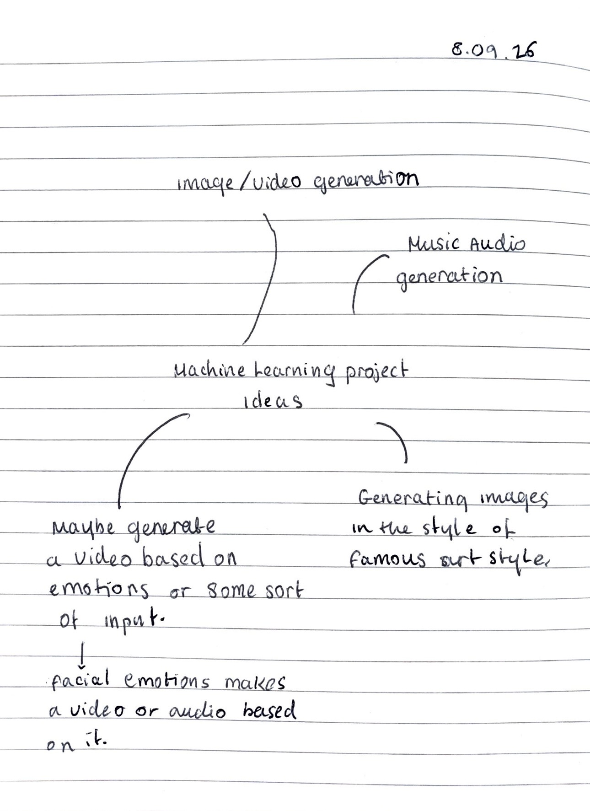
</p>

 ---
 
<h2>Entery 2 (12 May 2026)</h2>
Diving deeper into my project idea, I didn't feel too emotionally drawn to the context of my previous idea, I wanted to add onto the theme of creating a machine leanering model that inputs peoples emotions via webcam and creating a visual generative video based on this. I felt as though this was quite boring and mundane there was no emotional attachment to this. Therefore, I have decided that I want to explore a more sensitive but emotionally compelling theme of using news data and headlines instead.

<h3>Project Concept: 'The news as a nervous System'</h3>
<p>Creating a Machine learning system trained on live news data (as input) that classifies the emotional state of the current world events, measuring fear, anger, sadness and hope.
Outputs a real time abstract visual in p5.js that responds to those emotional scores.
AI used as witness to political trauma, the gap between data and human feeling, whose news gets coverage</p>


<p align='center'>
  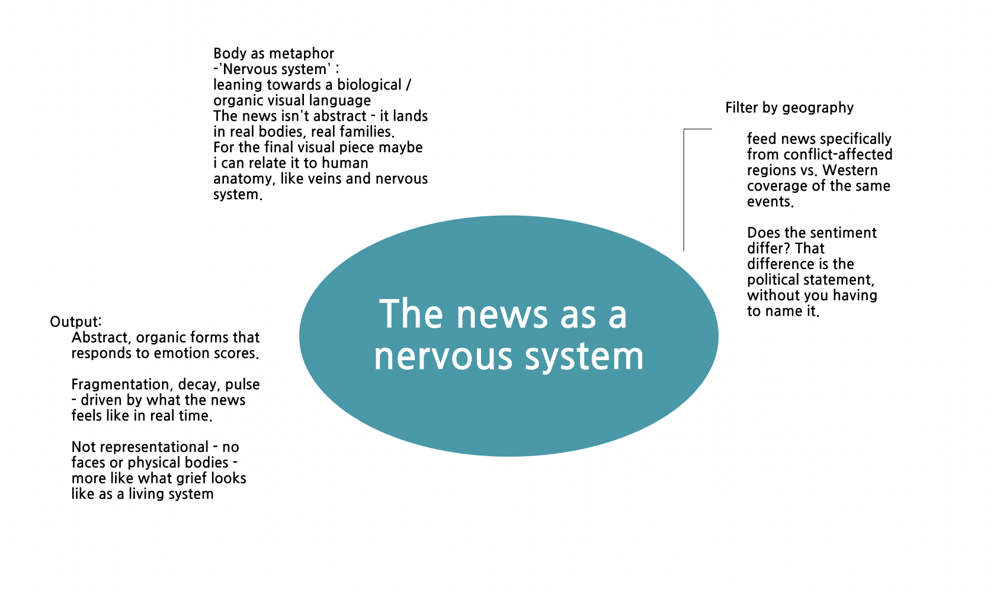
</p>

<h4>The ML part:</h4>
<ul>
  <li>Input: News headlines from newsAPI.org</li>
  <li>Model: a sentiment/emotion classified</li>
  <li>Output: numerical scores per emotion category of my choosing</li>
  <li>The scores drive the p5.js visuals</li>
</ul>

<h3>Context</h3>
I wanted to make this project abit personal to me, as i often do with my projects, i feel like it relates more to an audience that also likes emotional attachment with artistic and technical pieces. I want to be attached to my pieces and create something i know alot of people will resonate with as well. My thought process actually came from how the current news and state of the world especially in the Middle East affected me and my family as well as many other people in the same situation. Coming from Iran watching the current state of the world is genuinely devestating, and with the rest of my family living with bombs dropping next to their houses, I feel bad that this is their reality and they cannot leave and we can not visit our motherland. I always knew that the news affects everyone differently and there is always negative emotions. However, for the first time i saw how it psychologically transformed one of my family members, making them relaps into psychosis and schitzophrenic episodes. She, disasociated with her reality and lost herself into a deep psychological parallel reality, because shes scared for the state of Iran and when can she go back to see her family. I was terrified of the hellucinations i was hearing about, and started to witness and understand a whole different level of psychological trauma about hearing unsettling news. Which is why I wanted to name this project 'The News as a Nervous System'. 

<h3>Artist references</h3>

<p align='center'>
  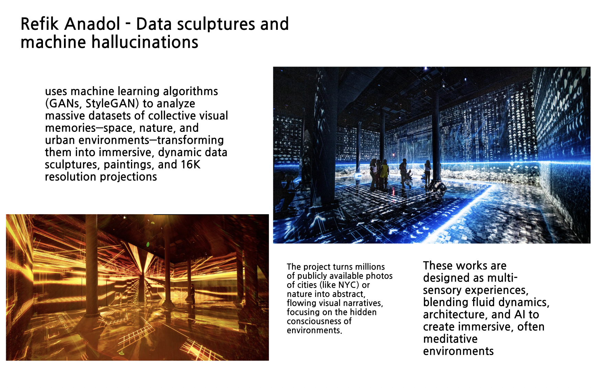 
  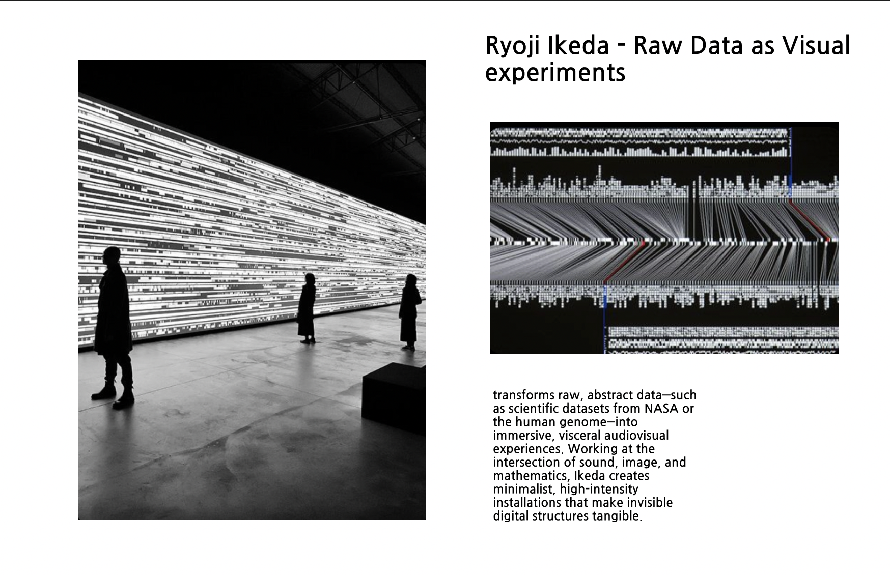 
</p>

---

<h2>Entery 3 (19 May 2026)</h2>

So far in the project I have:

<ul>
  <li>Got news Api free key at newsApi.org</li>
  <li>Wrote python script to pull live headlines</li>
  <li>Tested a pre-trained emotion model from huggingFace</li>
</ul>

<p align='center'>
  

  
This is the news api website where I got a personalised api key to include in my python code to grab current trending news data.

</p>


<p align='center'>
  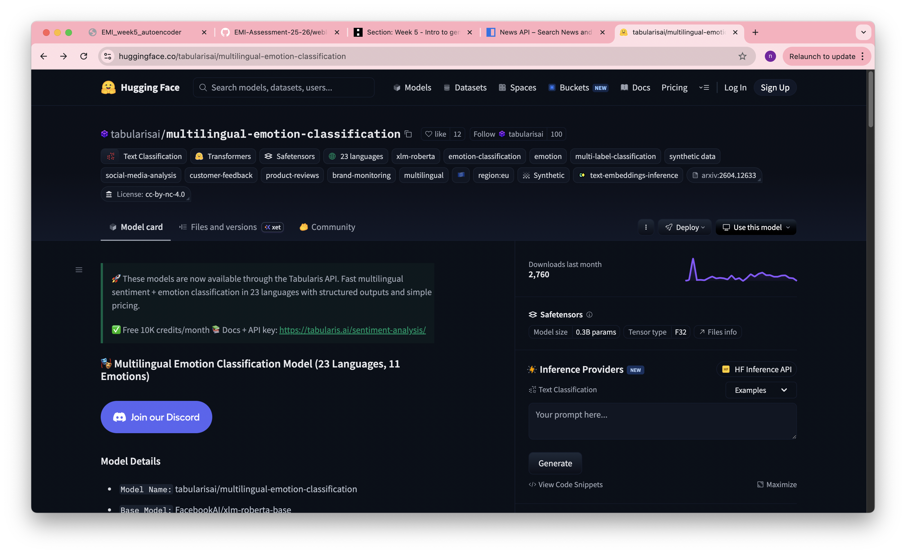

  This is the huggingFace website where I found my pre-trained emotion model and attached this model to detect the emotional states of news headlines i got from the news Api.
</p>


<h4>current code</h4>

[news.ipynb](assets/code/news.ipynb)

I used the code from the pre-trained model, as well as claude to help me debug and write some logic.

---

<h2>Entery 4 (29 May 2026)</h2>
In this entry I wrote a code that cleanes up the emotional score from the news headlines.

```
all_scores = {}

for headline in headlines[:5]:
    result = emotion_model(headline[0])
    print(result)
    for emotion in result[0]:
        label = emotion["label"]
        score = emotion["score"]

        if label not in all_scores:
          all_scores[label] = 0  
        all_scores[label] += score 

print(all_scores)

for label in all_scores:
   all_scores[label] = all_scores[label] / len(headlines)
print(all_scores)
```

<p align='center'>
  
  The results are visible at the bottom, which is the average scores of the different emotional states.
</p>


<p align="center">
  

I wrote a function that prints me the highest score from all the news headline emotional scores, to then create a prompt for image generation later on, I want my model to create a Image based on the emotional score and prompt it recieves.
The output after running the the code block, creating a prompt for the image generator is "grey static, empty void, quiet desolation", which means neutral is the dominant emotion in today's news. Which I found quiet interesting, since the model reads the news as mostyl neutral, which says something about how news language is written to sound objective even when the content is devestation. Which I am not sure if I really like that its sticking with neutral I want it to reflect the devestation that is resonated with me.

</p>

<h2>Entery 5 (17th june 2026)</h2>

In todays session, I went through 03_StableDiffusion_animation.ipynb, to generate my propmts from the my previous step into images. The current prompt is:

```
def get_prompt():
    #finding the highest emotional score
    highest = max(all_scores, key=all_scores.get)

    if highest == "fear":
        return "dark fragmented abstract, ominous atmosphere, deep red and black"
    elif highest == "anger":
        return "violent fracture, burning edges, chaotic turbulence"
    elif highest == "sadness":
        return "muted grey dissolution, slow decay, heavy silence"
    elif highest == "disgust":
        return "corrupted forms, toxic green and black, unsettling decay"
    elif highest == "surprise":
        return "fragmented light, scattered forms, electric blue and white"
    else: 
        return "grey static, empty void, quiet desolation"
    

prompt = get_prompt()
print(prompt)

```

<p>
  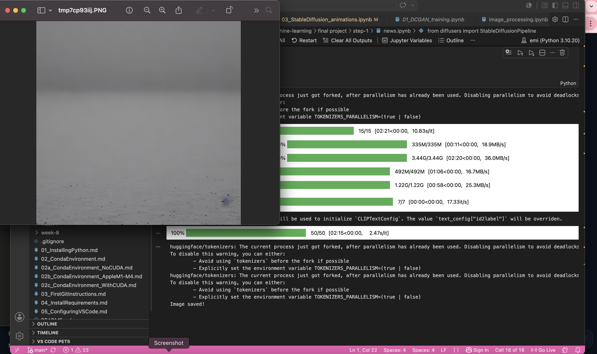
</p>

This is the image that was generated based on my prompt, abit vague but now i know that the image generation is actually working. 

I did face a couple challanges trying to get this to work, firstly:
getting the emotion model to run was the first major obstacle. The EMI kernel has troch 2.12 installed but most HuggingFace models required a newer version. Several models crashed the kernel entirely. Eventually solved by pinning transformers to version 4.30.0 and using device =-1 to force   CPU mode. 

Network restrictions was the second big challenge. The HuggingFace Inference API was completely blocked on UAL wifi, even switching to a personal hotspot didn't immediately fix it because the Mac was still routing through university network. Eventually discovered that urllib could reach huggingFace.co but requests couldn't, pointing to a DNS issue specific to the EMI kernel's network configuration.

Library version conflicts between diffusers, transformers, and huggingface_hub caused repeated ImportErrors. diffusers 0 .14.0 was incompatible with the installed huggingface_hub. Solution was pinning all three libraries to compatible versions: `transformers==4.30.0, diffusers==0.21.0, huggingface_hub==0.16.4`.

The reward, after all of that, the full pipeline ran end to end for the first time. Live news headlines -> emotion classification -> averaged scores -> prompt generation -> Stable Diffusion image. The output was a grey desolate abstract image, matching the 'neutral' dominant emotion of today's news cycle.

<h2>Entry 6</h2>

<h3>Generating different images based on prompts</h3>

<p align="center">
  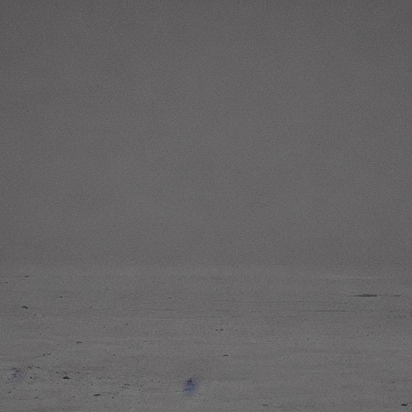

  In this image i just used the prompt i mentioned earlier, simple abstract gray scale, however It seemed too simple and vague and I wanted more complex images to be generated.

</p>

I updated my get_prompt() function and the image below is what the ai created.

```
def get_prompt():
    #finding the highest emotional score
    top_emotions = sorted(all_scores, key=all_scores.get, reverse=True)[:3]

    descriptions = {
    "fear": "a rotting fruit decaying in darkness, black mould spreading, dramatic lighting",
    "anger": "a burning cracked pomegranate, red flames, violent fracture",
    "sadness": "a wilting flower dissolving into grey dust, slow decay, muted tones",
    "disgust": "rotting organic matter, toxic green mould, unsettling decay",
    "surprise": "an exploding fruit, scattered fragments, electric blue light",
    "neutral": "a single grey fruit sitting in empty void, quiet, still",
    "joy": "a blooming flower, warm golden light, flowing organic forms"
}
    
    prompt_parts = [descriptions[e] for e in top_emotions if e in descriptions]
    return ", ".join(prompt_parts)
```

<p align='center'>
  

  This image was abit more complex which i find quite interesting I changed the prompt description to give me the top 3 emotions from the headlines and create a image based on that.
</p>

An observation i found is that the model keeps printing the news headlines as neutrsl, as if it doesnt want to induldge in reality of the news, I dont like this, because majority of the time the news is not neutral, I removed that emotion to see what it calculates if it doesnt have neutral as an option.

<h2>Entry 7</h2>

<h4>Changing the prompt</h4>

I changed the code again and removed neutral as an option for emotion:

```
def get_prompt():
    #finding the highest emotional score
    top_emotions = sorted(all_scores, key=all_scores.get, reverse=True)
    top_emotions = [e for e in top_emotions if e != "neutral"][:3]

    descriptions = {
    "fear": "a rotting pomegranate decaying in darkness, deep red and black, cinematic, highly detailed",
    "anger": "a burning cracked pomegranate, red orange flames, violent, dramatic lighting, cinematic",
    "sadness": "a wilting flower dissolving, blue and grey tones, melancholic, cinematic, detailed",
    "disgust": "rotting organic matter, toxic green and black, unsettling, macro photography",
    "surprise": "an exploding fruit, vivid colours, electric blue and white, dramatic",
    "joy": "a blooming flower, warm golden light, vibrant colours, beautiful"
}
    
    prompt_parts = [descriptions[e] for e in top_emotions if e in descriptions]
    return ", ".join(prompt_parts) + ", no text, no watermark, vivid colours, dramatic lighting"
```

Interesting enough, the model continues to produce neutral gray destaturated images even when prompted with vivid colours. The AI refuses to fully express the emotional weight of political trauma. However I am determined to break it, I want it to add weight to the emotions and produce a colourful piece.

<p align='center'>
  
  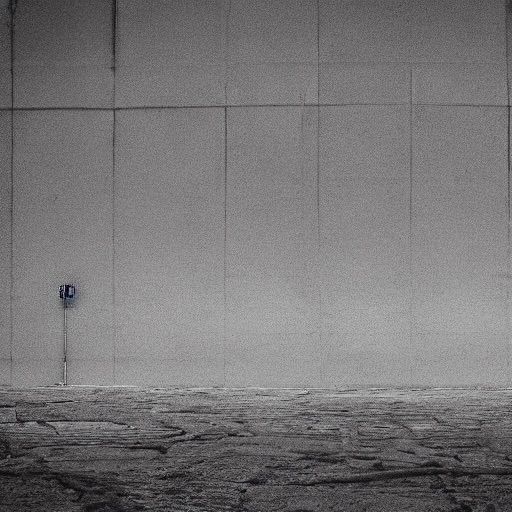
</p>


Breakthrough!!

<p align='center'>
  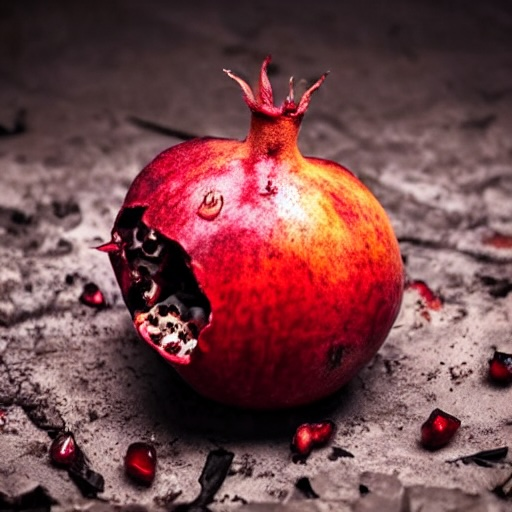
  
  It produced this image from the top 3 emotions which is: fear, anger and sadness.
</p>

<p align='center'>
  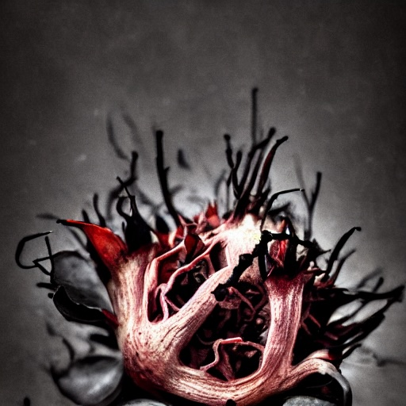

  This one is quite disturbing and freaky looking i kind of like it.
</p>

<h2>Entry 8</h2>

<p align='center'>
  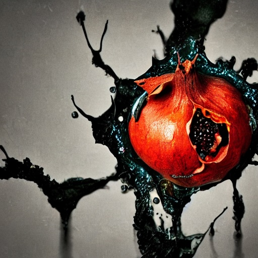
  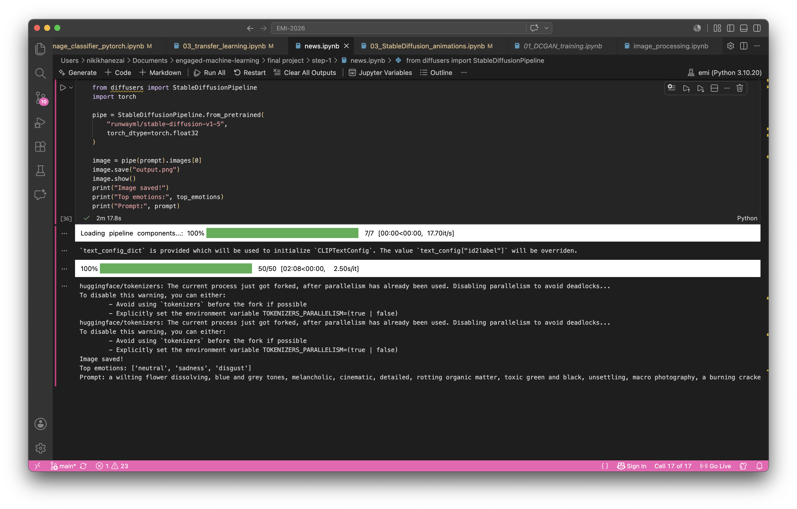
</p>

I wrote this at the end to clearly tell me the top 3 emotions it used and the prompt as well, 

```
print("Top emotions:", top_emotions)
print("Prompt:", prompt)
```

I thought i had a breakthrough but it still uses neutral however, neutral doesnt dominate the entire image now and is not the main emotion so i am pleased about that. 


I created a moodboard based on the emotions i found, and i adjusted the code prompt based on the images of the moodboard:

<p>
  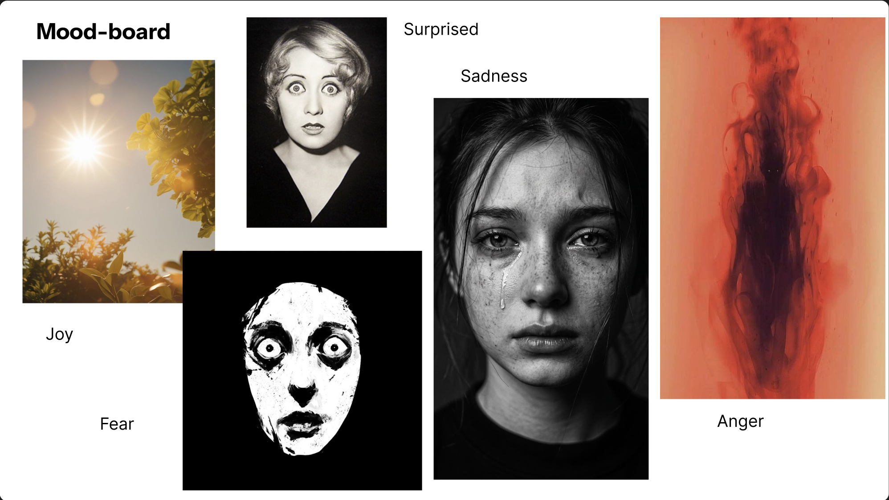
</p>

```
def get_prompt():
    top_emotions = sorted(all_scores, key=all_scores.get, reverse=True)
    top_emotions = [e for e in top_emotions if e != "neutral"][:3]

    descriptions = {
        "anger": "a dark dissolving figure consumed by red smoke, blurred and fractured form, deep crimson and black, violent motion, abstract painterly style, dramatic lighting, no text, vivid colours",
        "sadness": "a face dissolving into darkness, tears streaming down, black and white, high contrast, raw grief, cinematic portrait, dramatic shadow, no text, highly detailed, melancholic",
        "fear": "an abstract painted face, hollow wide eyes, stark white and black, expressive brushstrokes, mask-like distorted features, dark void background, raw terror, painterly style, high contrast, no text",
        "disgust": "a rotting pomegranate split open, decaying organic matter, mould spreading across the surface, toxic green and deep red, visceral and repulsive, macro photography, dramatic lighting, no text, vivid colours",
        "surprise": "a wide eyed abstract face, eyes enormous and hollow, shocked open mouth, black and white high contrast, vintage photographic style, dramatic shadow, frozen in disbelief, no text, cinematic",
        "joy": "golden sunlight bursting through flowering trees, warm lens flare, vibrant greens and yellows, light flooding through leaves, joyful and alive, cinematic, warm tones, no text, beautiful"
    }

    prompt_parts = [descriptions[e] for e in top_emotions if e in descriptions]
    return ", ".join(prompt_parts) + ", no text, no watermark, vivid colours, dramatic lighting"

prompt = get_prompt()
print(prompt)

```

<p align='center'>
  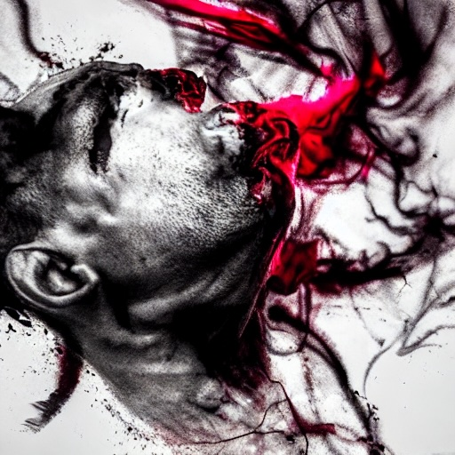
  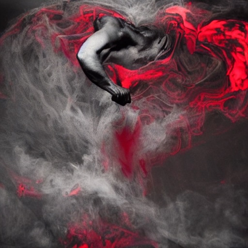
</p>

```
Top emotions: ['neutral', 'anger', 'sadness']
Prompt: a dark dissolving figure consumed by red smoke, blurred and fractured form, deep crimson and black, violent motion, abstract painterly style, dramatic lighting, no text, vivid colours, a face dissolving into darkness, tears streaming down, black and white, high contrast, raw grief, cinematic portrait, dramatic shadow, no text, highly detailed, melancholic, a rotting pomegranate split open, decaying organic matter, mould spreading across the surface, toxic green and deep red, visceral and repulsive, macro photography, dramatic lighting, no text, vivid colours, no text, no watermark, vivid colours, dramatic lighting
```

<h2>Entry 9</h2>

Gathering news headlines

<h2>Entry 10</h2>

creating the video 
